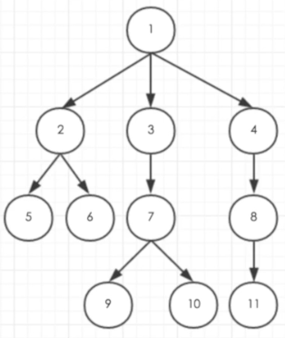
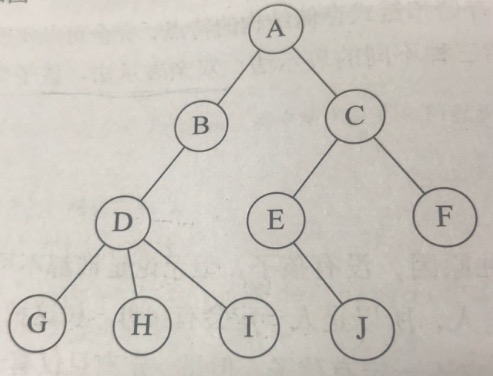
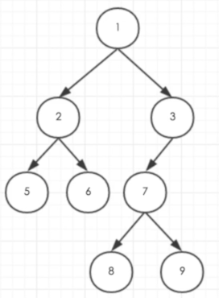

# data-structure-4
## 6 树  
### 6.1 树的定义  
首先明确几个概念：结点，空树(结点为0)，树，根，子树，森林  
结点的分类：根结点，叶结点（终端结点），分支结点（非终端结点，内部结点），孩子，双亲，祖先，子孙，堂兄弟  
结点拥有的子树数目称为度  
  
从图中看，1结点就是根结点，从1分叉出了2、3、4分支结点，1结点度为3，2、3、4是1的孩子结点，2、3、4互为兄弟结点，1为2、3、4的父结点  
这棵树的深度（高度）为4（一共4层），深度与度要区分开  
### 6.2 树的存储结构  
树的存储结构的三种表示法：双亲表示法，孩子表示法，孩子兄弟表示法  
双亲表示法： data数据域，存储结点的数据信息；parent指针域，存储该结点的双亲在数组中的下标；约定根结点的位置域设置为-1  
  
```
双亲表示法：
下标：    0123456789
data：   ABCDEFGHIJ
parent：-1001223334
```
```
改进的双亲表示法：增加长子域（没有孩子的结点就设置为-1），也可以记录右兄弟的下标rightsib
下标：       0123456789
data：      ABCDEFGHIJ
parent：   -1001223334
firstchild：13469-1-1-1-1-1
```
孩子兄弟表示法的结果就是把一棵复杂的树变成了二叉树，也就是接下来的内容  
### 6.3 二叉树  
  
* 二叉树的特点：  
每个结点最多有两棵子树；  
左子树和右子树有顺序的。  
* 二叉树的五种基本形态：  
空二叉树；  
只有一个根结点；  
根结点只有左子树；
根结点只有右子树；
根结点既有左子树又有右子树。  
* 特殊二叉树：  
斜树（左斜树，右斜树）  
满二叉树  
完全二叉树  
判断满二叉树与完全二叉树的方法：看编号是否连续  
* 二叉树的性质：  
《大话数据结构》p169-p171  
* 二叉树的存储结构：  
顺序存储结构：对于一般的二叉树，可以按照完全二叉树进行编号，把不存在的结点设置为"^",但是这样做显然会造成存储空间的浪费，所以顺序存储结构一般只用于完全二叉树  
链式存储结构（二叉链表）：为每个结点设计一个数据域和两个指针域(data,lchild,rchild)  
如果需要的话，再设置一个指向双亲的指针域，则称之为三叉链表  
* 二叉树的遍历： 
  
前序遍历（根左右）{1,2,5,6,3,7,8,9}  
[用python实现二叉树前序遍历](py_tree.py)  
```
// 前序遍历递归算法
void PreOrderTraverse(BiTree T)
{
  if (T==NULL)
    return;
  printf("%c",T->data);
  PreOrderTraverse(T->lchild);
  PreOrderTraverse(T->rchild);
}
```
中序遍历（左根右）{5,2,6,1,8,7,9,3}  
```
// 中序遍历递归算法
void InOrderTraverse(BiTree T)
{
  if (T==NULL)
    return;
  PreOrderTraverse(T->lchild);
  printf("%c",T->data);
  PreOrderTraverse(T->rchild);
}
```
后序遍历（左右根）{5,6,2,8,9,7,3,1}  
```
// 后序遍历递归算法
void PostOrderTraverse(BiTree T)
{
  if (T==NULL)
    return;
  PreOrderTraverse(T->lchild);
  PreOrderTraverse(T->rchild);
  printf("%c",T->data);
}
```
根据前中后序遍历序列来确定一棵二叉树：  
已知前，中，可以确定；  
已知后，中，可以确定；  
已知前，后，不能。  
* 二叉树的建立  
原二叉树的扩展二叉树：将二叉树中每个结点的空指针引出一个虚结点，用“#”表示  
```
void CreateTree(BiTree *T)
{
  TElemType ch;
  scanf("%c",&ch);
  if(ch=='#')
    *T=NULL;
  else
  {
    *T=(BiTree)malloc(sizeof(BiTNode));
    if(!*T)
      exit(OVERFLOW);
      (*T)->data = ch;
      CreateBiTree(&(*T)->lchild);
      CreateBiTree(&(*T)->rchild);
  }
}
```
* 线索二叉树  
大话数据P188-P194  
### 6.4 树，森林与二叉树的转换  
树转换为二叉树：加线，去线，层次调整；  
森林转换为二叉树：每棵树转化为二叉树，后一棵树的根结点作为前一棵树的右孩子；  
二叉树转换为树：加线，去线，层次调整；  
二叉树转换为森林：右孩子分离，分离后的二叉树转化为树。  
### 6.5 霍夫曼树  
大话数据P203-P207  
